# Readme
## Background 项目背景
This project is an AI painting master based on the Pytorch framework and style transfer technology. It mainly refers to the [Pytorch tutorial](https://www.pytorchtutorial.com/pytorch-style-transfer/) and the paper [A Neural Algorithm of Artistic Style](https://arxiv.org/abs/1508.06576).
In addition, compared to the original thesis tutorial, we have made certain modifications to the model structure to make the visual effect better.

本项目是基于Pytorch框架，风格迁移技术的AI绘画大师，主要参考了Pytorch官方tutorial中的[教程](https://www.pytorchtutorial.com/pytorch-style-transfer/)和论文[A Neural Algorithm of Artistic Style](https://arxiv.org/abs/1508.06576)。
另外，相比于原论文教程，我们在模型结构上做出了一定的修改，使得视觉效果更好。

## Preview 效果预览
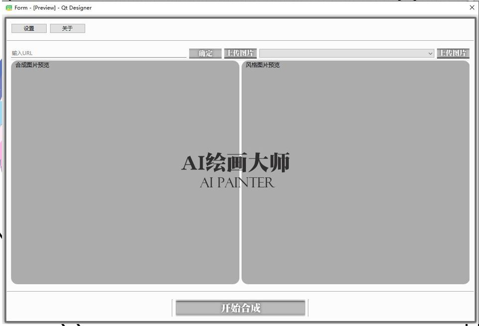
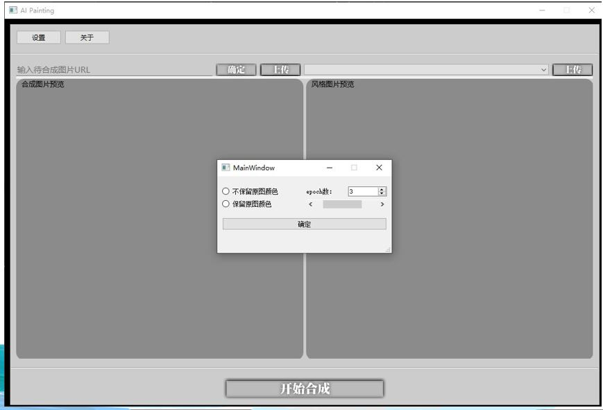
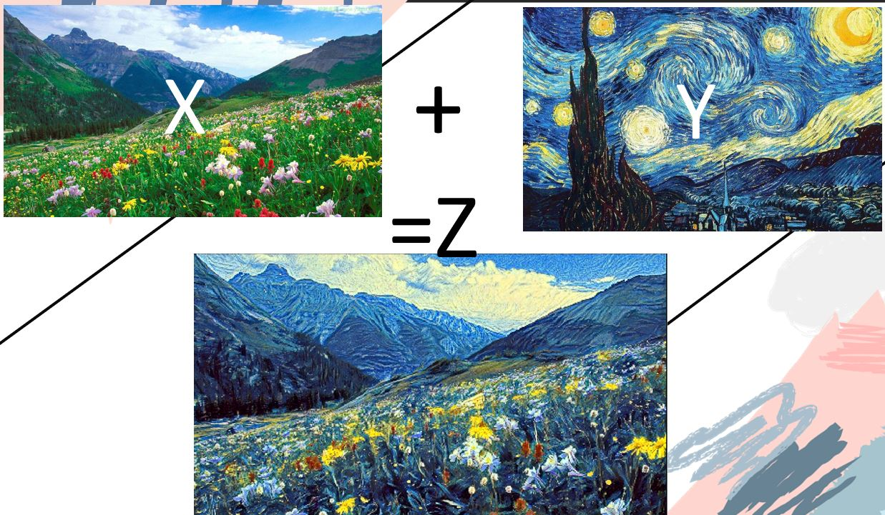
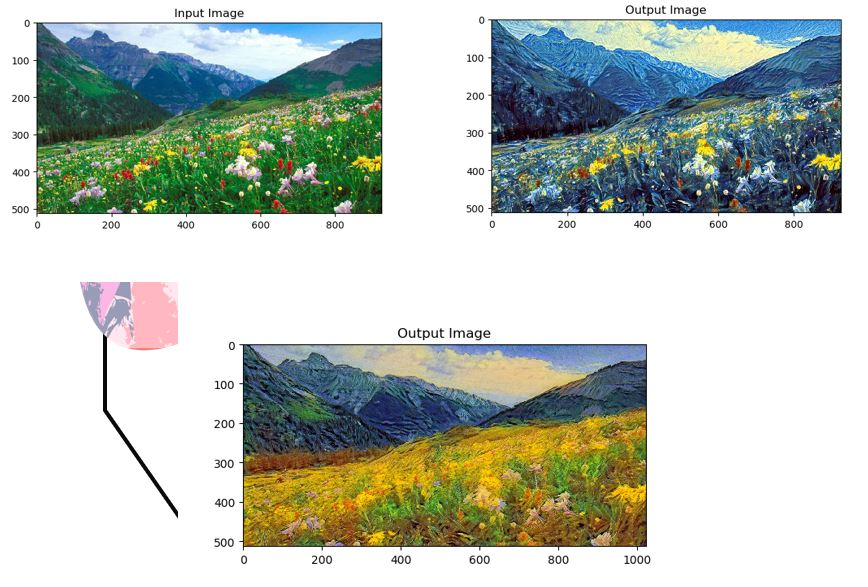
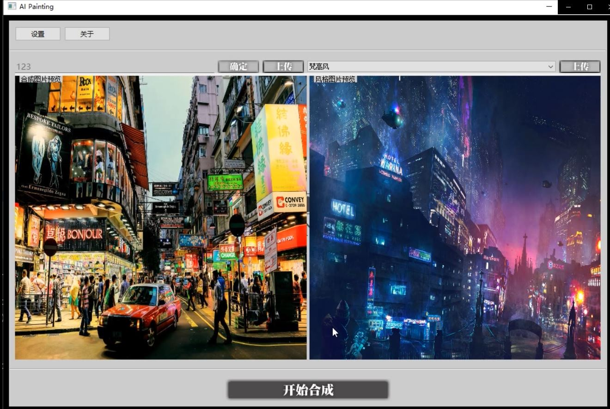
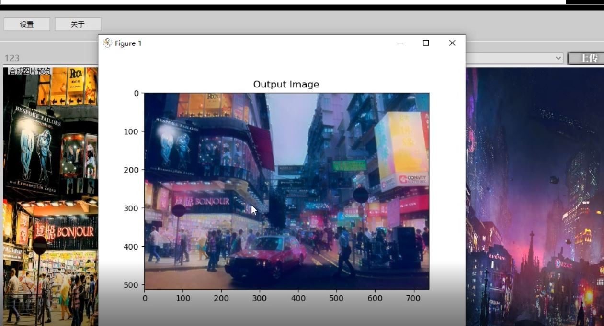

## Innovation 创新点
### 1. Modify the content layer 修改内容层
The original paper used conv_4 as the content layer. We used conv_4, conv_5, conv_6, and conv_7 as the content layer. Although it is not reflected in the data result, it has a better visual effect.

原论文以conv_4作为内容曾，我们将conv_4,conv_5,conv_6,conv_7作为内容层，虽然在数据上体现不大，但是在肉眼可见的视觉方面效果更好。

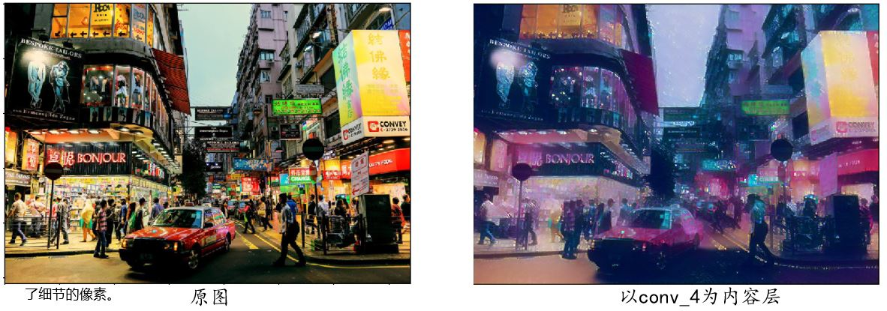
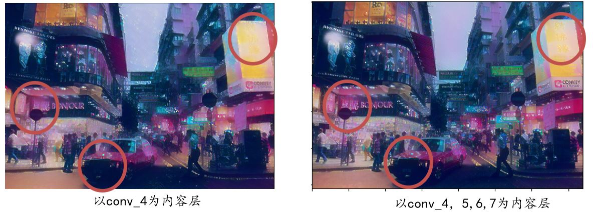
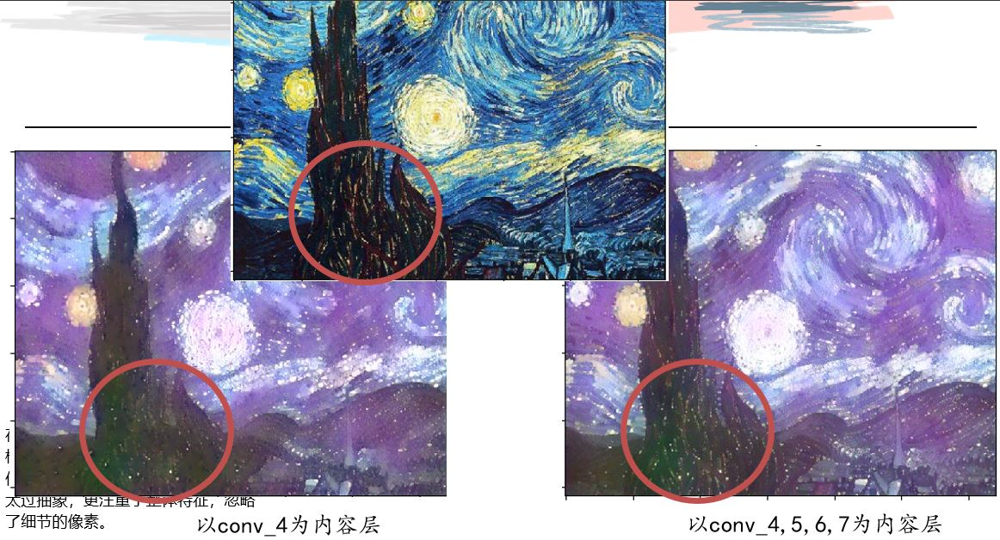

It can be clearly found that choosing conv_4, conv_5, conv_6, and conv_7 as the content layer, the overall style of the image does not change much, but the details are clearer.

可以明显发现，选用conv_4,conv_5,conv_6,conv_7作为内容层，图像整体风格变化不大，但是细节方面更加清晰。
### 2. Modify the Optimizer 修改优化器

The original paper used L-BFGS as the optimizer. In the actual operation, we found that it was slower and completely changed the color of the original image and modified it to the Adam optimizer.

原论文使用L-BFGS作为优化器，在实际运行过程中，我们发现其速度较慢，且完全改变了原图的颜色，修改为Adam优化器。

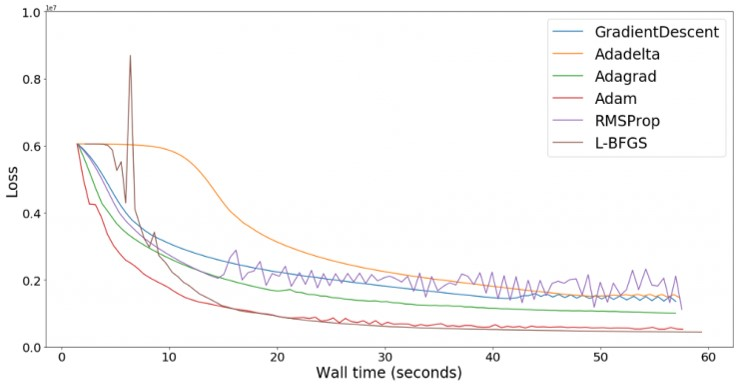
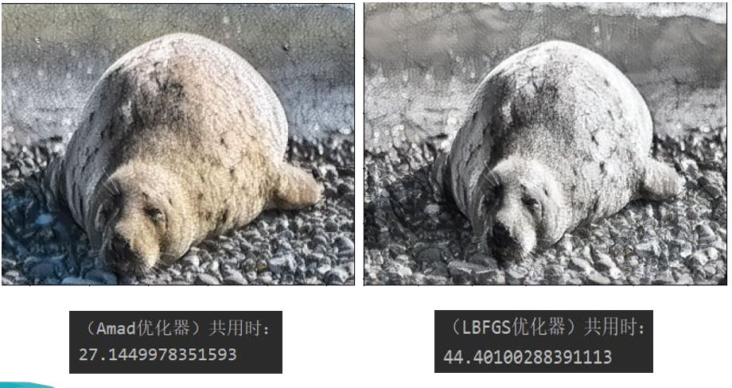

### 3. Modify the loss function 修改损失函数
The original paper uses MSE_LOSS for calculation. After consulting many documents, we found that in the style transfer project, the effect of L1_loss may be better than L2_loss (MSE_loss), so we tried.

原文中使用MSE_LOSS用于计算，我们在查阅许多资料文献后发现，在风格迁移这个项目中，L1_loss的效果可能比L2_loss（MSE_loss）效果更好，故进行了尝试。

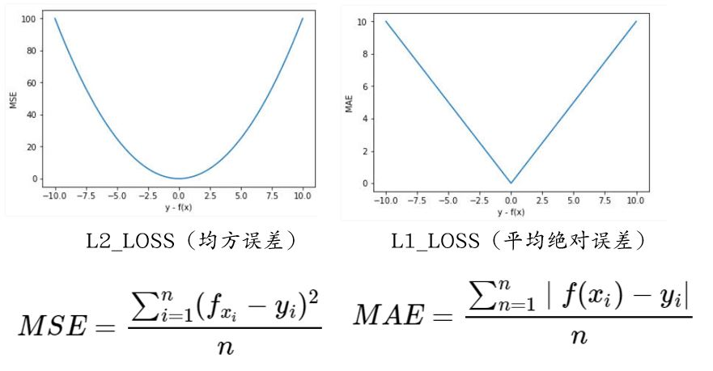

Obviously, looking at the picture, it can be seen that L1_Loss is not sensitive to outliers, and when we perform style transfer, we do not need to completely integrate the features of the style picture with the content picture. In many cases, keeping some of the content picture features is more effective, so we hope to keep some outliers.

显然，看图可以得知，L1_Loss对于离群点并不敏感，而我们在进行风格迁移的时候，并不需要完全将风格图片的特征与内容图片融合，很多时候保留部分内容图片特征反而效果更好，所以希望保留一些离群点。

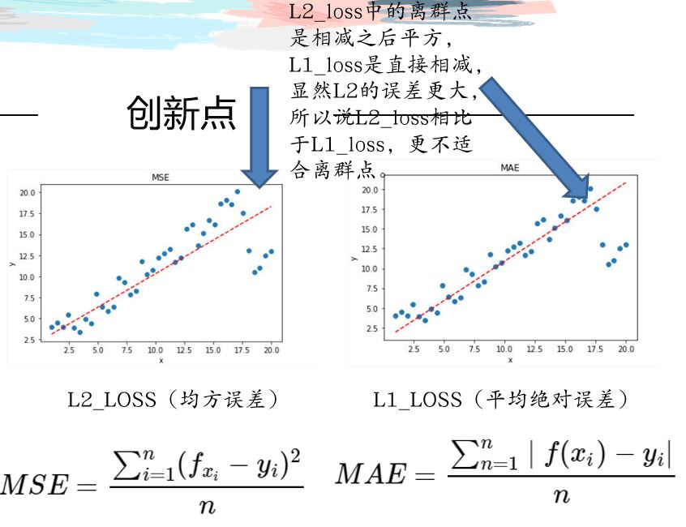

效果如图

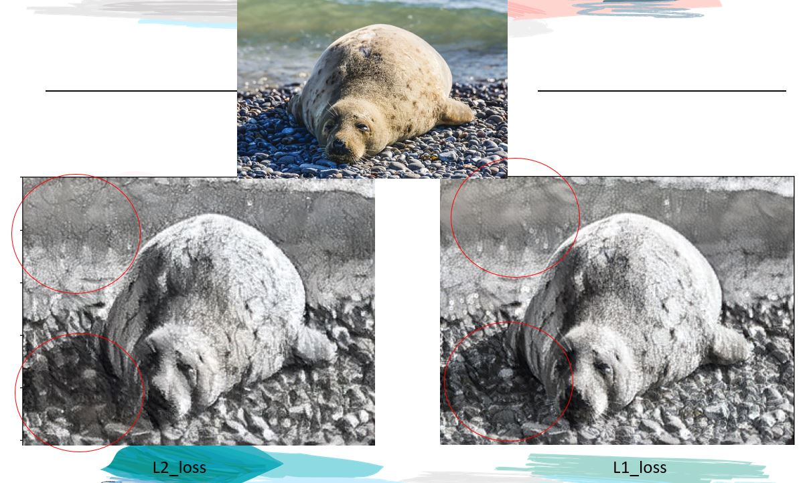
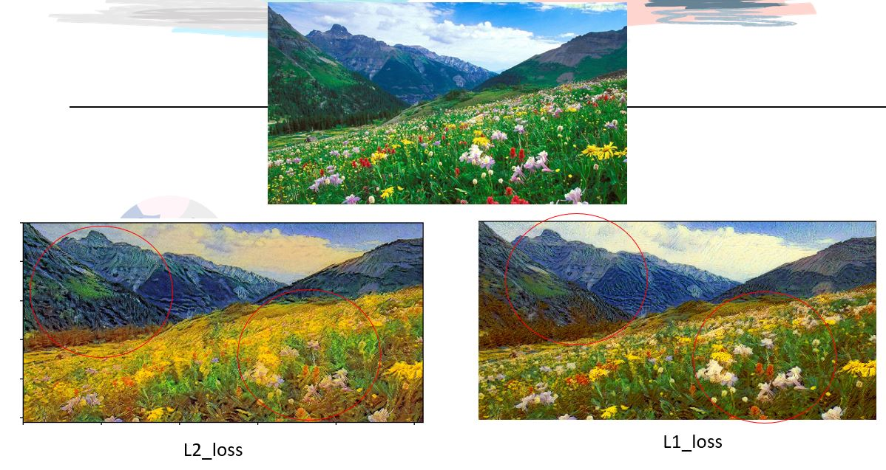

## Code 代码解读
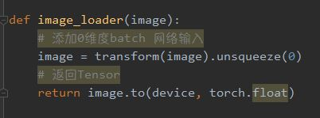

导入图片

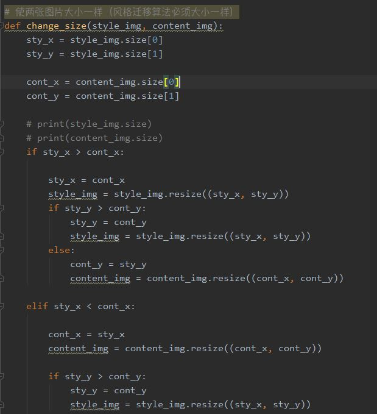

修改图片大小，风格迁移算法要求两张图片大小一致

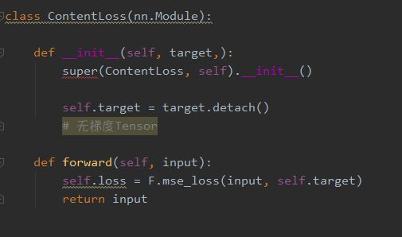

计算内容差异

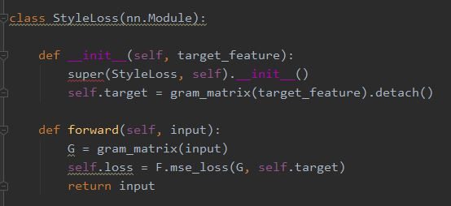

计算风格差异

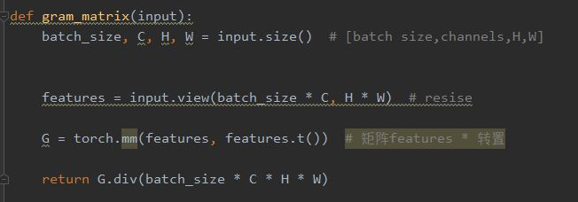

设定gram矩阵

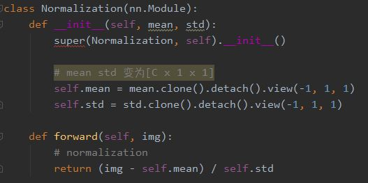

Normalizing

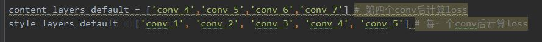

此处设定对于实现的图像细节视觉效果来说非常重要，相比于原论文，我们这里做了修改，使得视觉效果更好。

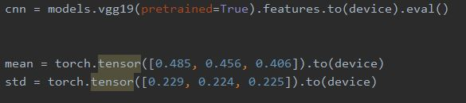
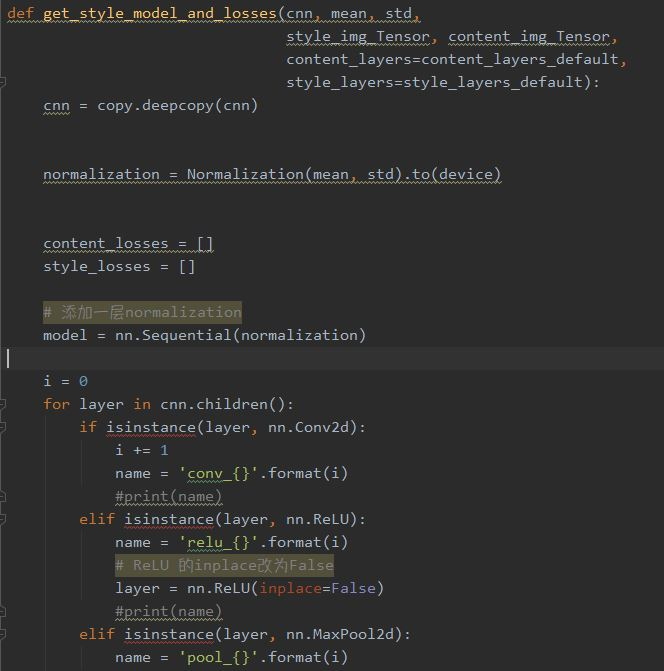

训练模型